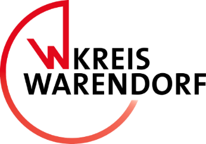

# Form-Backend

An Express backend for serving dynamic forms based on custom configurations via a webapp, integrating with PostgREST for data access.

## Demo Application

A simple demo application with some sample forms can be found in `./demo`.
Take a look at `./demo/README.md` for details on how to get the demo
up and running.

## Docs

User docs are available on a running instance on `/docs`.

## App

A React webapp to to render dataview tables and forms. While the table view shows all records in a filterable overview table, the detail view renders the actual form to edit a record. Several specific Postmessage API events supports the integration of the webapp in other clients (e.g. to visualize spatial data). See [app/README.md](respective README) for more information.

## Backend
The backend that will serve the webapp as well as handle requests. [PostgREST](https://postgrest.org) is required to access data and [keycloak](https://keycloak.org) for authentification. Please check the `demo` folder to run a test setup.

## Development Guide

For our guidelines for contributions, please take a look at CONTRIBUTING.md. Head there if you need general advice for first contributing steps (code or documentation).

More detailed information to ensure a great development experience when working on the form-backend is summarized in the respective READMEs (`backend` and `app`). You'll find hints with regard to developing UI components or guidance when you want to enhance (or create) parsers for style formats or data formats there.

Additionally, please read through our code of conduct.

We look forward to seeing you contribute soon!

## Acknowledgements

This software was initially developed within a project context along with the [Kreisverwaltung Warendorf](https://www.kreis-warendorf.de/) and funded by the European Union’s NextGenerationEU programme.

